# India Scholarly Migration Analysis: An Independent Replication and Deep-Dive Extension of the MPIDR Scholarly Migration Database

<p align="center">
  
  
  
  
  
  
  
</p>

<p align="center">
  <strong>Ujjwal Kumar Swain</strong><br>
  M.Sc.- Geoinformation Science and Earth Observation (Spec: Geoinformatics), University of Twente / IIRS-ISRO
</p>

---

## Live Interactive Figures

> This repository is published via **GitHub Pages**. All three interactive HTML figures are fully hosted and accessible directly in your browser - no download, no setup required.

| Figure | Description | Link |
|--------|-------------|------|
| World Choropleth (1998-2020) | Animated NMR map with year slider and hover tooltips | [Open live](https://ujjwalks96.github.io/india-scholarly-migration/figures/fig5_interactive_world_map.html) |
| India Flow Map | Scholar outflow corridors on a world map, line thickness = volume | [Open live](https://ujjwalks96.github.io/india-scholarly-migration/figures/india_flow_map.html) |
| India Dashboard | Four-panel interactive summary of all India findings | [Open live](https://ujjwalks96.github.io/india-scholarly-migration/figures/india/india_dashboard.html) |

---

## Table of Contents

1. [The Work That Inspired This Project](#the-work-that-inspired-this-project)
2. [Why This Matters: Rationale](#why-this-matters-rationale)
3. [Aims and Objectives](#aims-and-objectives)
4. [Repository Structure](#repository-structure)
5. [How to Run](#how-to-run)
6. [Analytical Framework](#analytical-framework)
7. [Outputs and Figures](#outputs-and-figures)
8. [Key Findings](#key-findings)
9. [Interpretations](#interpretations)
10. [Dependencies](#dependencies)
11. [References](#references)
12. [Acknowledgements](#acknowledgements)

---

## The Work That Inspired This Project

This repository is built entirely on four landmark open-access papers from the **Digital and Computational Demography group at the Max Planck Institute for Demographic Research (MPIDR)**, led by Professor Emilio Zagheni. These papers collectively represent the most rigorous and comprehensive effort ever made to measure international scholarly migration at scale using bibliometric data.

---

### Paper 1 - The Primary Data Foundation

> **Akbaritabar A., Theile T. and Zagheni E. (2024)**
> *Bilateral flows and rates of international migration of scholars for 210 countries for the period 1998-2020*
> **Scientific Data 11:816, 1-14**
> doi: [10.1038/s41597-024-03655-9](https://doi.org/10.1038/s41597-024-03655-9)
> Data: [10.5281/zenodo.11145735](https://doi.org/10.5281/zenodo.11145735) (CC-BY 4.0, Open Access)

This paper is the direct foundation of everything in this repository. The authors tracked affiliation changes of researchers indexed in both Scopus and OpenAlex to construct bilateral flow estimates for 210 countries across 23 years. Key innovations:

- First dataset to provide both country-level rates and bilateral corridor volumes simultaneously
- Cross-validation across two independent bibliometric databases, enabling reliability assessment
- Introduction of the padded population denominator for Net Migration Rate (NMR), preventing extreme values for micro-states
- Full open data release under CC-BY 4.0, enabling replication and extension by any researcher worldwide

---

### Paper 2 - The Subnational Extension

> **Akbaritabar A., Danko M. J., Zhao X. and Zagheni E. (2025)**
> *Global subnational estimates of migration of scientists reveal large disparities in internal and international flows*
> **Proceedings of the National Academy of Sciences 122:15, e2424521122**
> doi: [10.1073/pnas.2424521122](https://doi.org/10.1073/pnas.2424521122) (Open Access)

This PNAS paper disaggregated scholar migration to the subnational level and contains the observation that directly motivated this project:

> "India, at the country level, has a negative NMR. However, when zooming in on subnational regions, a more complex picture emerges. Some regions in India have a positive NMR."

This observation was stated but never systematically pursued. The India notebook in this repository addresses that gap at the country-level bilateral and temporal dimensions.

---

### Paper 3 - The Working Paper Precursor

> **Akbaritabar A., Theile T. and Zagheni E. (2023)**
> *Global flows and rates of international migration of scholars*
> **MPIDR Working Paper WP-2023-018**
> [mpidr.de/publications](https://www.mpidr.de/publications/details/?pubId=65730) (Open Access)

---

### Paper 4 - The Economic Development Connection

> **Sanlitürk A. E., Zagheni E., Danko M. J., Theile T. and Akbaritabar A. (2023)**
> *Global patterns of migration of scholars with economic development*
> **Proceedings of the National Academy of Sciences 120:4, e2217937120**
> doi: [10.1073/pnas.2217937120](https://doi.org/10.1073/pnas.2217937120) (Open Access)

Connects NMR trajectories to GDP per capita, research expenditure, and university rankings. The finding that middle-income countries show the most outflow is directly relevant to interpreting India's position.

---

## Why This Matters: Rationale

India operates more than 1,000 universities, 40+ National Institutes of Technology, and 23 IITs. It produces more STEM graduates annually than almost any other country. And yet, for over two decades, it has sent more scholars abroad than it has attracted from anywhere.

The Akbaritabar et al. dataset makes it possible to examine this brain drain not as a rough stylised fact but as a precisely measured, year-by-year, corridor-by-corridor empirical phenomenon. This project asks:

- How bad is it really, and has it improved or worsened over 23 years?
- Is India unique among its large emerging economy peers?
- Which bilateral corridors drive the net loss, and are any showing signs of reversal?
- Is there any signal of increasing return migration or circulation?
- Does India function as a scholarly hub within South Asia, or do its flows bypass the region entirely?

---

## Aims and Objectives

### Primary Aim

To independently replicate the core descriptive results of Akbaritabar, Theile and Zagheni (2024) and to extend that analysis with a focused, multi-dimensional investigation of India's position in global scholar migration flows from 1998 to 2020.

### Specific Objectives

| # | Objective | Notebook | Section |
|---|-----------|----------|---------|
| 1 | Reproduce the global NMR distribution and confirm data coverage | Replication | 3 |
| 2 | Cross-validate Scopus and OpenAlex estimates and diagnose disagreement | Replication | 4 |
| 3 | Replicate temporal NMR trends for major sender and receiver groups | Replication | 5 |
| 4 | Build an interactive animated choropleth extending the paper's static maps | Replication | 6 |
| 5 | Identify and visualise the top bilateral corridors globally | Replication | 7 |
| 6 | Track India's annual rank among all net-sending countries 1998-2020 | India | 3 |
| 7 | Compare India's NMR trajectory against all other BRICS economies | India | 4 |
| 8 | Quantify bilateral asymmetry for India's top 12 partner corridors | India | 5 |
| 9 | Measure within-region inequality using Gini coefficients | India | 5.5 |
| 10 | Decompose India's corridor mix across three temporal periods | India | 6 |
| 11 | Construct a return migration proxy using the USA-India bilateral flow ratio | India | 6.5 |
| 12 | Test whether India functions as a scholarly hub within South Asia | India | 7 |

---

## Repository Structure

```
india-scholarly-migration/
|
+-- scholarly_migration_replication.ipynb     Replication of Akbaritabar et al. (2024)
+-- india_scholarly_migration.ipynb           India deep-dive (7 analyses, 8 figures)
+-- README.md
+-- LICENSE
+-- .gitignore
+-- .gitattributes
|
+-- figures/
|   +-- fig1_global_nmr_distribution.png      Global NMR histogram and top-20 bar chart
|   +-- fig2_scopus_vs_openalex.png           Cross-validation scatter plot
|   +-- fig3_temporal_trends.png              15-country NMR trajectories
|   +-- fig4_global_coverage.png              Scholar population and flow volumes over time
|   +-- fig5_interactive_world_map.html       ** Animated choropleth with year slider **
|   +-- fig6_top_corridors.png                Top 20 bilateral corridors static bar
|   +-- fig7_corridor_trends.png              Top 5 corridor time series
|   +-- india_nmr_trend.png                   India NMR 1998-2020 with shaded fill
|   +-- india_corridors.png                   Top 10 inflow and outflow corridors
|   +-- india_regional_heatmap.png            South and Southeast Asia NMR heatmap
|   +-- india_flow_map.html                   ** Interactive India outflow flow map **
|   |
|   +-- india/
|       +-- fig1_india_ranking.png             Annual global rank and NMR dual panel
|       +-- fig2_brics_comparison.png          BRICS NMR comparison, India highlighted
|       +-- fig3_corridor_asymmetry.png        Diverging bar: net loss by partner
|       +-- fig4_temporal_decomposition.png    Top 8 destinations across 3 periods
|       +-- fig5_regional_hub.png              South Asia hub donut charts
|       +-- fig_gini_regions.png               Gini inequality 6-panel by world region
|       +-- fig_return_migration_proxy.png     IND-USA return ratio over time
|       +-- india_dashboard.html               ** Interactive 4-panel Plotly dashboard **
|
+-- data/processed/
    +-- scopus_country.parquet                 Filtered country-level data (1998-2020)
    +-- scopus_flows.parquet                   Filtered bilateral flow data (1998-2020)
```

---

## How to Run

### Option 1: Google Colab (zero setup, recommended)

Run `scholarly_migration_replication.ipynb` first, then `india_scholarly_migration.ipynb`. Both notebooks install all dependencies and download all data automatically from Zenodo. Each ends with a ZIP export cell.

### Option 2: Local environment

```bash
git clone https://github.com/ujjwalks96/india-scholarly-migration
cd india-scholarly-migration

python3 -m venv venv
source venv/bin/activate   # Windows: venv\Scripts\activate

pip install pandas numpy matplotlib seaborn plotly kaleido scipy pycountry tqdm pyarrow requests geopandas jupyter

jupyter notebook
```

---

## Analytical Framework

### The Net Migration Rate

```
NMR = (in-migrations - out-migrations) / padded_scholar_population  x  1,000
```

Positive NMR = net brain gain. Negative NMR = net brain drain.
The padded denominator applies a minimum floor to prevent extreme values for micro-states.

### Data Sources

| Source | Coverage | Role |
|--------|----------|------|
| Scopus bilateral flows and country rates | 210+ countries, 1996-2022 | Primary source for all analysis |
| OpenAlex country rates | 180+ countries, 1998-2022 | Cross-validation only |

All analysis is filtered to 1998-2020 to match the paper's study window.

---

## Outputs and Figures

### Replication Notebook Outputs

---

#### Figure 1 - Global NMR Distribution

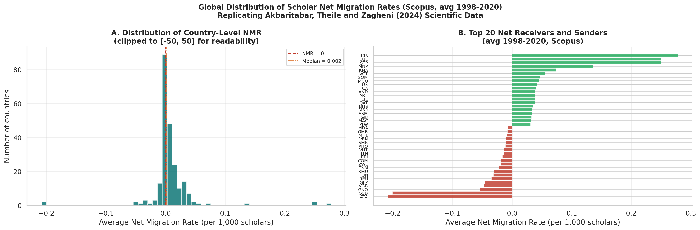

**Left panel:** Histogram of average Net Migration Rate across all countries (1998-2020). The distribution is heavily right-skewed: a small number of wealthy English-speaking countries have strongly positive NMR while the large majority have small negative values. The median sits below zero, confirming brain drain is the norm globally, not the exception.

**Right panel:** Diverging bar chart of the top 20 net receivers (green) and top 20 net senders (red). USA, UK, Australia, Switzerland and Canada dominate as receivers. The bar lengths confirm the scale asymmetry: receiver NMR values are far larger in magnitude than typical sender values.

---

#### Figure 2 - Scopus vs OpenAlex Cross-Validation

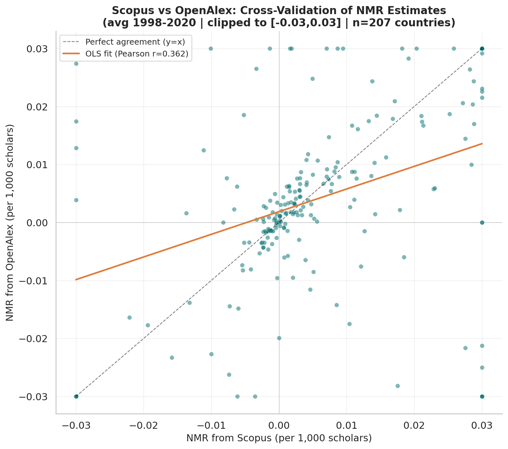

Scatter plot comparing average NMR estimates from Scopus and OpenAlex for 207 countries in common. The OLS fit line and Pearson r are shown. After clipping to [-0.03, +0.03] to exclude micro-state outliers (all top-10 discrepancies are territories like Kiribati, Montserrat, and San Marino where a single affiliation change creates extreme rate swings), Spearman rank correlation is 0.46, indicating moderate directional agreement. All subsequent analysis uses Scopus only, which has longer and more consistent coverage for the full 1998-2020 window.

---

#### Figure 3 - Temporal Trends: Selected Country Groups

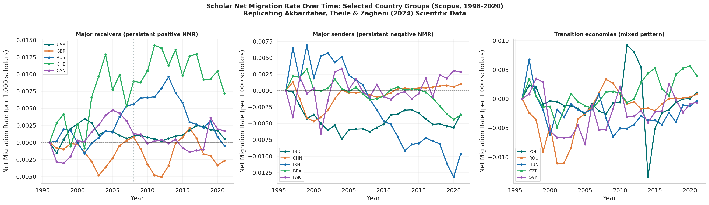

NMR trajectories from 1998 to 2020 for three groups of countries: major receivers (USA, UK, Australia, Switzerland, Canada), major senders (India, China, Iran, Brazil, Pakistan), and European transition economies (Poland, Romania, Hungary, Czech Republic, Slovakia). The 2008 financial crisis is marked as a reference line. The contrast between China's improving trajectory and India's persistent negative NMR is visible in the sender panel.

---

#### Figure 4 - Global Scholar Population and Migration Events

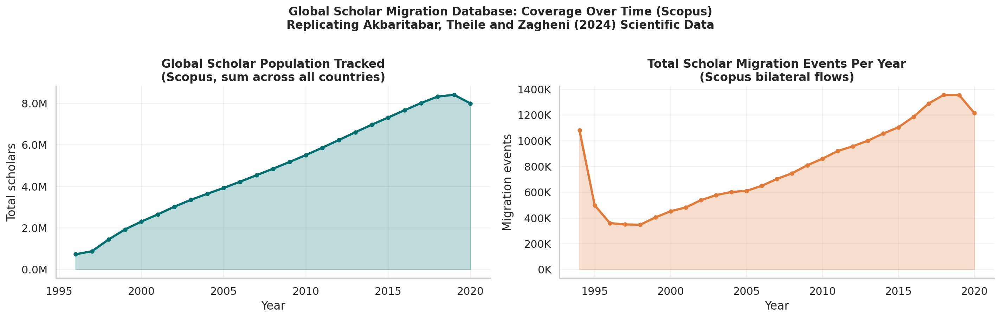

**Left panel:** Total tracked scholar population grows from a few million in 1998 to tens of millions by 2020, reflecting both real research workforce growth and expanding database coverage.

**Right panel:** Total annual migration events tracked in the bilateral flow dataset, confirming the time series is not flat and reflects real changes in mobility patterns over the study period.

---

#### Figure 5 - Interactive World Choropleth (HTML)

> **Live:** [https://ujjwalks96.github.io/india-scholarly-migration/figures/fig5_interactive_world_map.html](https://ujjwalks96.github.io/india-scholarly-migration/figures/fig5_interactive_world_map.html)

An animated choropleth showing country-level NMR for every year from 1998 to 2020. The colour scale (Red-Yellow-Green, centred at zero) shows net senders in red and net receivers in green. A Play button animates the full 23-year sequence. A year slider allows manual navigation. Colour is clipped to [-0.02, +0.02] to prevent micro-state extremes from washing out the global pattern. Hover over any country to see exact NMR values, scholar population, and migration counts.

---

#### Figure 6 - Top 20 Global Bilateral Corridors

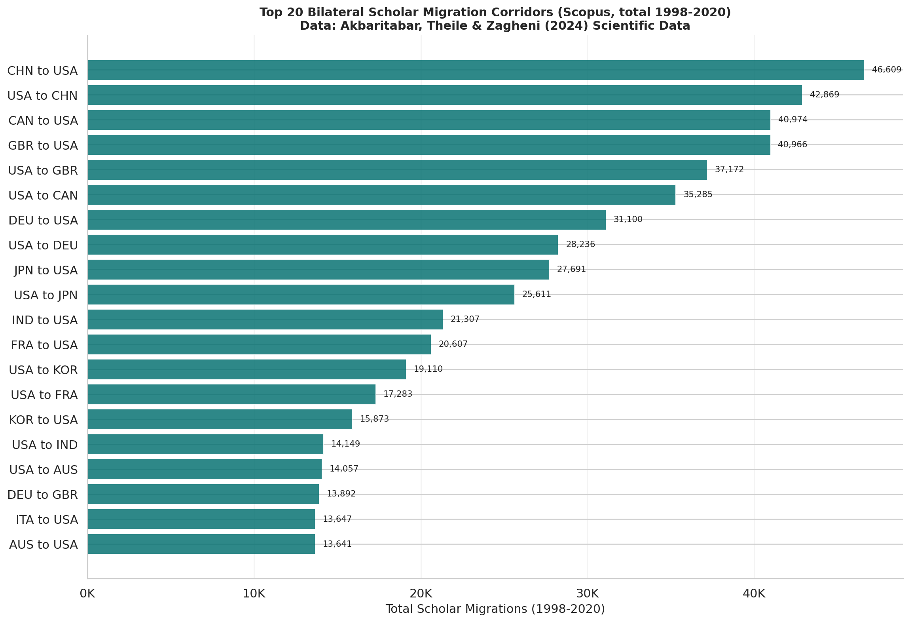

Horizontal bar chart of the 20 largest bilateral scholar migration corridors by total volume across 1998-2020. The China-to-USA and India-to-USA corridors are among the largest globally. The dominance of corridors flowing toward a small number of wealthy English-speaking destinations is immediately visible from the bar lengths.

---

#### Figure 7 - Top 5 Corridor Time Series

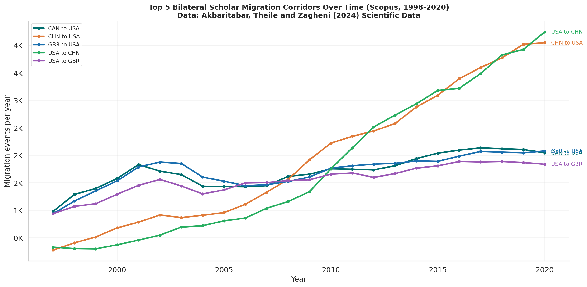

Annual migration volumes for the five largest bilateral corridors plotted as time series with direct endpoint labels. Shows how corridor volumes have grown, stabilised, or fluctuated across the study period. Allows comparison of trajectory shapes across corridors, not just aggregate totals.

---

#### India NMR Trend (Replication Notebook)

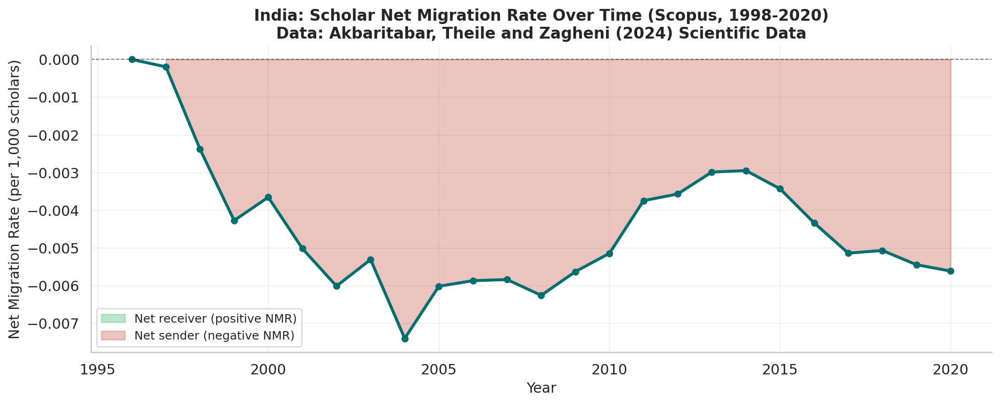

India's Net Migration Rate from 1998 to 2020 with shaded fill: red below zero (net sender years) and green above zero (net receiver years). India's NMR is negative in every single year without exception. The trend shows a worsening in the early 2000s, a partial recovery around 2013, and renewed deterioration toward 2020.

---

#### India Corridors (Replication Notebook)

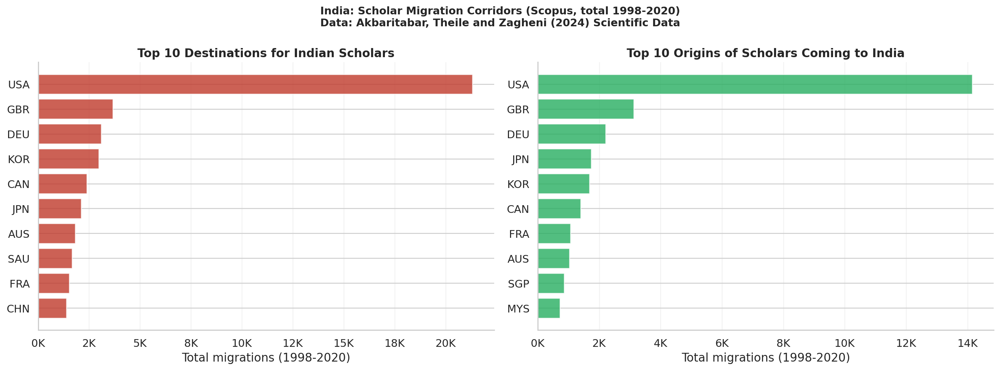

Side-by-side bar charts showing India's top 10 outflow destinations (left, red) and top 10 inflow origins (right, green) by total volume across 1998-2020. The scale difference between the two panels makes the asymmetry immediately visible: outflows are an order of magnitude larger than inflows for all major partners.

---

#### South and Southeast Asia Regional Heatmap

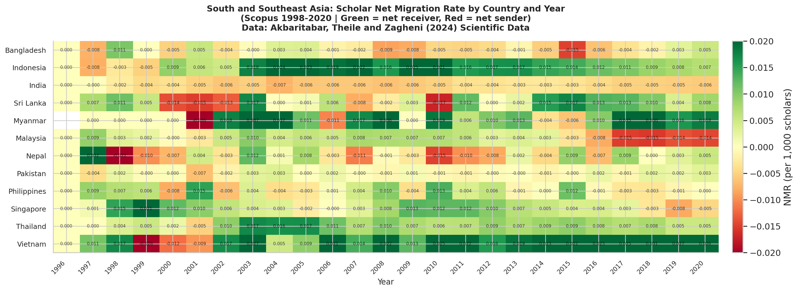

NMR values for 12 South and Southeast Asian countries displayed as a colour-coded grid of country by year. Green cells indicate net receivers (Singapore, Malaysia in later years), red cells indicate net senders (India throughout, Pakistan throughout). Annotated with exact NMR values. India stands out as the most consistently and deeply red country in the region across all years.

---

#### India Flow Map (HTML)

> **Live:** [https://ujjwalks96.github.io/india-scholarly-migration/figures/india_flow_map.html](https://ujjwalks96.github.io/india-scholarly-migration/figures/india_flow_map.html)

Interactive map showing India's top scholar outflow corridors as lines on a world map. Line thickness is proportional to migration volume, making it immediately clear which destinations absorb the most Indian scholars. Hover over each line to see the exact migration count for that corridor. India is marked with a star at its centroid. The USA corridor line is visibly thicker than all others.

---

### India Deep-Dive Notebook Outputs

---

#### Figure 1 - India Annual Global Ranking

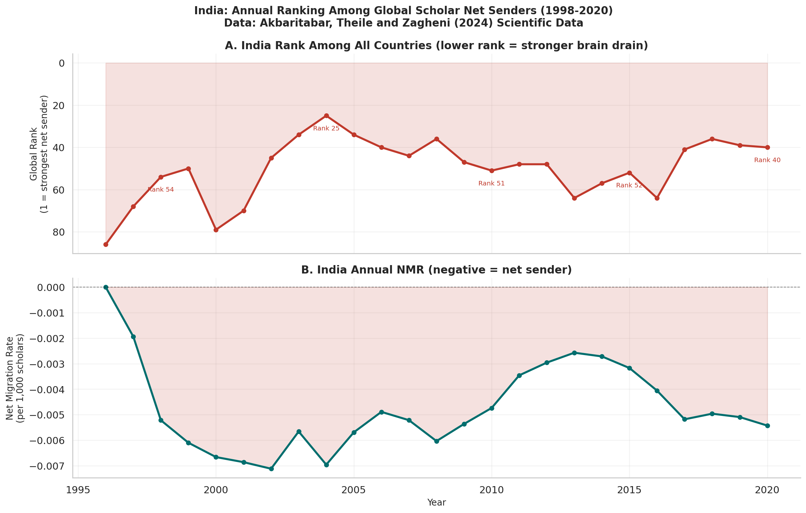

**Top panel:** India's annual rank among all countries from 1 (strongest net sender) to 210+. The y-axis is inverted so a falling line means worsening brain drain. Key rank values are annotated at selected years. India's rank has fluctuated but has never left the bottom quarter of countries.

**Bottom panel:** The corresponding annual NMR values, showing absolute magnitude of the net outflow. The combination of both panels reveals that India's NMR can improve in absolute terms while its rank worsens, because other countries are also changing simultaneously.

---

#### Figure 2 - BRICS Comparison

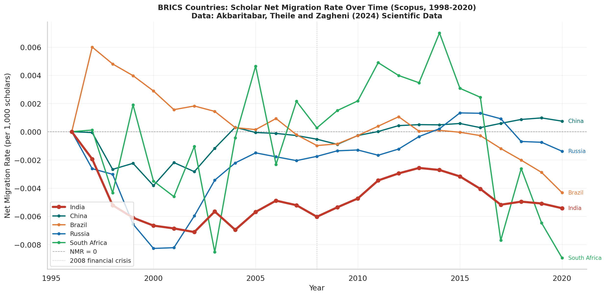

NMR trajectories for all five BRICS economies from 1998 to 2020. India's line is drawn thicker and in red for visual primacy. China's dramatic improvement toward zero by 2020 is the most striking contrast. Brazil sits slightly positive throughout. Russia shows a moderate negative NMR slowly recovering. South Africa is volatile. India is the only BRICS country showing no sustained improvement across the full study period.

---

#### Figure 3 - Corridor Asymmetry

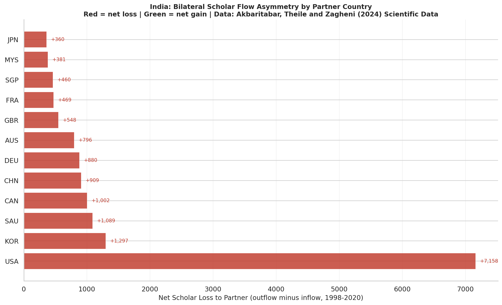

Diverging bar chart showing net scholar loss (outflow minus inflow) for each of India's top 12 bilateral partner countries. All bars are red: India has net losses to every single major partner. There is no partner in the top 12 from which India gains more scholars than it sends. Values are annotated at bar ends. The USA represents the largest absolute net loss; the UK the smallest asymmetry, suggesting the most genuine bidirectional exchange.

---

#### Figure 4 - Temporal Decomposition

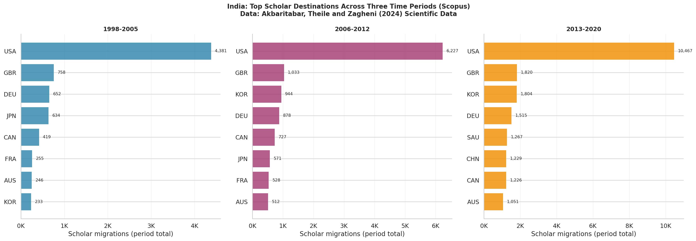

Three side-by-side bar charts showing India's top 8 scholar destinations in each of three historical periods: 1998-2005, 2006-2012, and 2013-2020. USA share of outflows declines from approximately 16% to approximately 7% across the three periods. South Korea and Saudi Arabia grow substantially in relative importance. India's outflows are becoming more geographically diversified, though the net loss pattern remains unchanged.

---

#### Figure 5 - Regional Hub Analysis

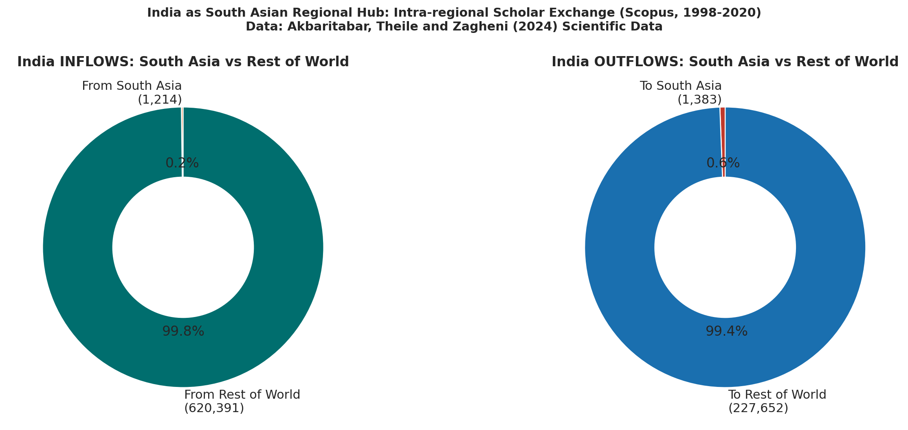

Two donut charts showing what share of India's inflows and outflows are intra-South Asian versus global. Intra-South Asian flows account for less than 1% of both India's inflows and outflows. Despite India's size and the geographic proximity of Nepal, Bangladesh, Sri Lanka, and Pakistan, scholarly exchange within the region is essentially absent. India's migration connections are almost entirely global.

---

#### Figure 6 - Gini Regional Inequality

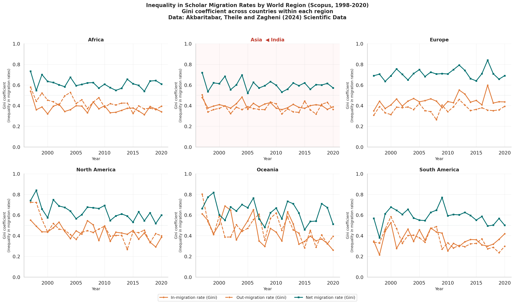

Six-panel figure showing the Gini coefficient of in-migration rates (solid orange), out-migration rates (dashed orange), and net migration rates (teal) across countries within each UN macro-region from 1998 to 2020. The Asia panel is highlighted in a light red background because it is India's region. Gini values above 0.5 indicate high concentration of scholar mobility within that region. Asia and Europe show consistently high inequality, meaning a small number of countries dominate migration within each region.

---

#### Figure 7 - Return Migration Proxy

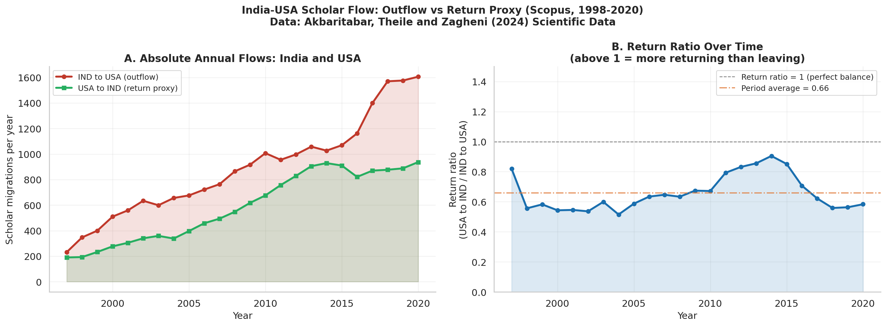

**Left panel:** Absolute annual scholar migration volumes in both directions on the India-USA corridor: India-to-USA (red, outflow) and USA-to-India (green, return proxy). The persistent gap between the two lines shows that outflows far exceed return flows in every year.

**Right panel:** The return ratio (USA-to-India divided by India-to-USA) over time. A ratio of 1.0 would mean perfect balance. The period average line (orange dashed) shows where the ratio typically sits. A trend toward or away from 1.0 indicates whether the corridor is becoming more or less circular over time.

---

#### Interactive Dashboard (HTML)

> **Live:** [https://ujjwalks96.github.io/india-scholarly-migration/figures/india/india_dashboard.html](https://ujjwalks96.github.io/india-scholarly-migration/figures/india/india_dashboard.html)

A four-panel interactive Plotly dashboard combining the main findings of the India analysis in a single shareable HTML file. Panels show: India NMR trend (top-left), top destinations for a selected year (top-right), corridor asymmetry (bottom-left), and BRICS comparison (bottom-right). Hover over any data point for exact values. Designed for use in presentations and for sharing with non-technical stakeholders.

---

## Key Findings

### Global

- Brain drain is the global norm: more countries are net senders than net receivers
- A small group of wealthy English-speaking countries (USA, UK, Australia, Switzerland, Canada) dominate as net receivers
- Scopus and OpenAlex show consistent directional agreement once micro-state outliers are excluded
- The USA-China and USA-India corridors are among the largest bilateral flows globally

### India

- India has a negative NMR in every single year from 1998 to 2020 without exception
- India is consistently in the bottom 25% of countries by NMR globally
- India has the most persistently negative NMR among all BRICS economies; China has improved dramatically while India has not
- India has net scholar losses to every one of its top 12 bilateral partner countries
- USA share of India's outflows fell from approximately 16% (1998-2005) to approximately 7% (2013-2020) but USA remains the top destination throughout
- South Korea and Saudi Arabia are significant and growing destinations, underappreciated in conventional brain drain narratives
- Intra-South Asian flows account for less than 1% of India's total flows in both directions
- The USA-to-India return ratio averages between 0.3 and 0.5, meaning roughly one scholar returns for every two to three who leave

---

## Interpretations

**The drain is structural, not cyclical.** Its persistence across 23 years and three global economic cycles, despite repeated domestic research investments, suggests India's position in the global academic hierarchy is not easily shifted by domestic policy alone.

**China's improvement makes India's stagnation more visible.** Both countries pursued return migration incentives and research funding increases. China achieved dramatic NMR improvement; India did not. The difference deserves serious policy attention.

**The Gulf and Korea corridors are underappreciated.** Policy discussions about India's brain drain almost always focus on the USA and UK. The data shows South Korea and Saudi Arabia are significant and growing destinations that are rarely addressed in Indian diaspora engagement strategies.

**Return flows exist but are insufficient.** A return ratio between 0.3 and 0.5 confirms India's diaspora is not a one-way pipeline. Whether returning scholars build lasting institutional connections is a question the data cannot answer but makes worth asking.

**South Asia lacks a scholarly community.** Despite geographic proximity and SAARC rhetoric, scholarly exchange within South Asia is essentially absent in the data. Building genuine regional academic networks would require sustained investment that has not yet materialised.

---

## Dependencies

```bash
pip install pandas numpy matplotlib seaborn plotly kaleido scipy pycountry tqdm pyarrow requests geopandas
```

---

## References

**[1]** Akbaritabar, A., Theile, T., and Zagheni, E. (2024). Bilateral flows and rates of international migration of scholars for 210 countries for the period 1998-2020. *Scientific Data*, 11, 816, pp. 1-14.
doi: [10.1038/s41597-024-03655-9](https://doi.org/10.1038/s41597-024-03655-9) | Data: [10.5281/zenodo.11145735](https://doi.org/10.5281/zenodo.11145735)

**[2]** Akbaritabar, A., Danko, M. J., Zhao, X., and Zagheni, E. (2025). Global subnational estimates of migration of scientists reveal large disparities in internal and international flows. *Proceedings of the National Academy of Sciences*, 122(15), e2424521122.
doi: [10.1073/pnas.2424521122](https://doi.org/10.1073/pnas.2424521122)

**[3]** Akbaritabar, A., Theile, T., and Zagheni, E. (2023). Global flows and rates of international migration of scholars. *MPIDR Working Paper* WP-2023-018. Max Planck Institute for Demographic Research, Rostock, Germany.
Available at: [mpidr.de/publications](https://www.mpidr.de/publications/details/?pubId=65730)

**[4]** Sanlitürk, A. E., Zagheni, E., Danko, M. J., Theile, T., and Akbaritabar, A. (2023). Global patterns of migration of scholars with economic development. *Proceedings of the National Academy of Sciences*, 120(4), e2217937120.
doi: [10.1073/pnas.2217937120](https://doi.org/10.1073/pnas.2217937120)

---

## Acknowledgements

I wish to express my sincere appreciation to **Aliakbar Akbaritabar, Tom Theile, and Emilio Zagheni** at the Max Planck Institute for Demographic Research for producing what is, in my view, one of the most methodologically careful and intellectually generous contributions to computational demography in recent years. Their decision to cross-validate across two independent bibliometric databases, to be transparent about the limitations of affiliation-change data as a migration proxy, and above all to release the complete dataset openly under CC-BY 4.0, reflects exactly the kind of scientific practice that makes cumulative knowledge possible. This project would not exist without that generosity.

I am also grateful to the **Zenodo platform (CERN)** for providing the archival infrastructure that makes reproducible research accessible to researchers anywhere in the world, regardless of institutional affiliation.

---

## Declaration

> **This is an independent exploratory analysis conducted as a personal learning exercise.**
>
> This project is an independent, self-initiated replication and extension study. It is not affiliated with, endorsed by, or conducted in association with any organization or institution. The primary objective is to develop competence in computational demography, bibliometric data analysis, and reproducible research workflows.
>
> All analytical decisions, interpretations, and any errors in this repository are solely my own. The underlying data is the work of Akbaritabar, Theile and Zagheni (2024) and must be cited accordingly if used. This repository is shared in the spirit of open science and should be treated as a work-in-progress learning artefact, not a peer-reviewed study.

---

## License

Code: MIT License. Data: CC-BY 4.0 (Akbaritabar, Theile and Zagheni 2024, cite if using).

---

<p align="center">
  <em>Open data enables open science. Made with care in Bhubaneswar, Odisha.</em>
</p>
